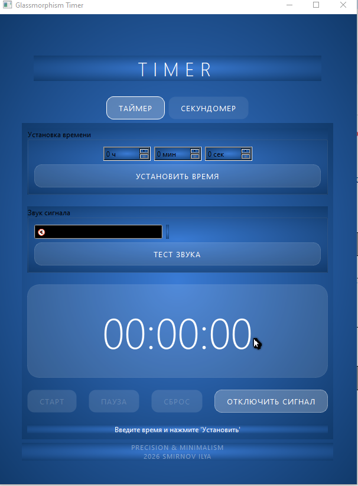

# ⏱️ TimerStopwatch

**Разработчик:** Смирнов Илья | Python, PySide6, GUI

---

## 📌 Общее описание

TimerStopwatch — это современное десктопное приложение на Python с графическим интерфейсом (PySide6), объединяющее **Таймер обратного отсчёта** и **Секундомер**.

Приложение выполнено в стиле **Glassmorphism** (стеклянный дизайн) с градиентным фоном и полупрозрачными элементами.

---

## 🎨 Дизайн и стиль

| Характеристика | Описание |
|---------------|----------|
| Стиль | Glassmorphism (стеклянный) |
| Фон | Радиальный градиент: #3a7bd5 → #001f3f |
| Элементы | Полупрозрачные (rgba), тонкие границы |
| Кнопки | Прозрачные стеклянные, при наведении подсветка |
| Текст | Белый, заголовки с большим межбуквенным интервалом |

---

## 🧩 Основные модули

### ⏱️ Таймер

| Функция | Описание |
|---------|----------|
| Установка времени | Часы (0-23), минуты (0-59), секунды (0-59) |
| Старт / Пауза / Сброс | Полное управление отсчётом |
| Звуковой сигнал | Выбор WAV-файла, тест звука, зацикливание |
| Автосохранение | Настройки сохраняются в settings.json |

### ⏱️ Секундомер

| Функция | Описание |
|---------|----------|
| Старт / Пауза / Сброс | Полное управление отсчётом |
| Фиксация кругов | Кнопка «ФИКСАЦИЯ» записывает время в список |
| Дисплей | Формат ЧЧ:ММ:СС.СС (сотые доли) |
| Список кругов | Отображает все зафиксированные круги |

---

## 🖥️ Главное окно

| Элемент | Описание |
|---------|----------|
| Заголовок | Меняется: TIMER / STOPWATCH |
| Вкладки | Кнопки «Таймер» и «Секундомер» с подсветкой активной |
| Стек виджетов | Переключение между таймером и секундомером |
| Футер | «PRECISION & MINIMALISM / 2026 SMIRNOV ILYA» |
| Сохранение состояния | Запоминает: последнюю вкладку, размер окна |

---

## 🛠️ Технологии

| Компонент | Технология |
|-----------|-----------|
| GUI | PySide6 (Qt for Python) |
| Звуки | winsound (встроенная библиотека Windows) |
| Стили | CSS / QSS (setStyleSheet) |
| JSON | Встроенный модуль json |
| Диалоги | QFileDialog (PySide6) |
| Качество кода | black |
| Контроль версий | Git, GitHub |

---

## 🚀 Как запустить

```bash
git clone https://github.com/mackros-333/timer-stopwatch.git
cd timer-stopwatch
python -m venv venv
.\venv\Scripts\activate
pip install PySide6
python main.py

```
---



---
## Структура проекта
~~~
Timer_Stopwatch/
├── main.py              # Главное окно
├── styles.py            # Единый файл стилей
├── settings.json        # Настройки (создаётся автоматически)
└── modules/
    ├── __init__.py
    ├── timer.py         # Таймер
    └── stopwatch.py     # Секундомер
~~~
---
## 🔧 Особенности реализации

- Адаптивный дизайн (окно можно менять, размер сохраняется)
- Кроссплатформенность (Windows, звуки через winsound)
- Модульность (таймер и секундомер в отдельных файлах)
- Централизованные стили (все стили в styles.py)

---
## 🎯 Что можно улучшить

- Сохранение выбранного звука между запусками
- Сохранение списка кругов при закрытии
- Экспорт кругов в .txt
- Горячие клавиши (Пробел — старт/пауза, Escape — сброс)
- MIDI-управление таймером

---
## Связь

📫 email: zaraza.my@mail.ru

~~~
